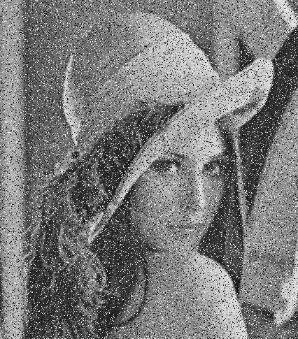
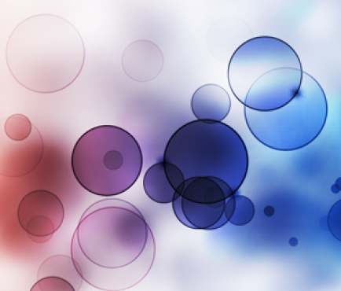

# Photoshop

**Image editing software for .pam and .bmp format**

---

---

## Layers

- Create new blank layer
- Add an image as a new layer
- Change layer order
- Delete layer
- Change layer opacity  
    It controls how much the layers below can show through 
    Example:  
    
    
    
    
    On the first image Bubbles layer has an opacity 100% (nothing below can show through).
    But on the second image Bubbles layer has an opacity 50% and we can see through the Bubbles to the    background Wars layer. 
    
- Make layer active / inactive

---

## Selections

**Use selections to edit part of an image**
 
 - Create rectangle selection
 - Delete selection 
 - Make selection active / inactive
 - Fill selection with one color  
   Example:    
    
   

---

## Operations

  - Create own operation  
    A lot of image operations are implemented and the user is allowed to make his own operation  
    Some implemented operations:
      - Grayscale
      - Invert
      - Median
      - Blak and white
      - Max / min
      - Pow, log, abs, mul, div, add, ...
  - Perform operation 
    Operation is performed only on active layers. If exists active selection then operation is performed only on selected part of an image.
    
 Operation Median (before and after):  
   
 Operation Inversion (before and after):  
 
   
   

---

## Saving project in XML format and reload project later
 
     
---

---

